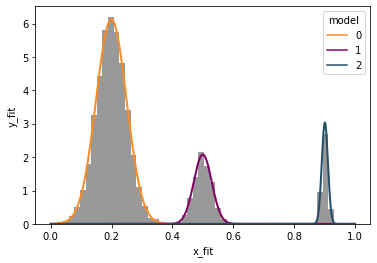

# Gaussian Mixture Model Simulation and Fitting

This Python script simulates a dataset composed of multiple Gaussian distributions, and then fits a Gaussian Mixture Model (GMM) to the simulated data. The process includes visualizing the simulated data and the fitted GMM components for clear, intuitive understanding.

## Features

- **Dataset Simulation**: Generates a dataset with three distinct Gaussian peaks. In the example script, the simulated data has the following parameters:
  - Peak 1: Mean = 0.2, Standard Deviation = 0.05, Sample Size = 5000
  - Peak 2: Mean = 0.5, Standard Deviation = 0.03, Sample Size = 1000
  - Peak 3: Mean = 0.9, Standard Deviation = 0.01, Sample Size = 500

- **Data Visualization**: 
  - A histogram line plot to visualize the distribution of the simulated dataset.
  - An overlay of the histogram with the individual Gaussian components extracted from the fitted GMM.

- **Gaussian Mixture Model (GMM) Fitting**: Utilizes the `GaussianMixture` class from `sklearn.mixture` to fit a GMM with three components to the simulated data.

- **Parameter Extraction**: Extracts the means, weights, and covariances of the fitted Gaussian components.

- **Fit Visualization**: Plots the fitted Gaussian components on the same histogram, with distinct colors for each component to show how well the GMM fits the data.

## Requirements

- Python 3.x
- Pandas
- NumPy
- Matplotlib
- Seaborn
- SciPy
- Scikit-learn

## Usage

1. **Run the script**: Execute the script to generate the simulated dataset, fit the GMM, and visualize the results.
2. **View the Visualizations**: Observe the initial histogram of the simulated data, and the final plot showing the GMM fit with individual Gaussian components.
